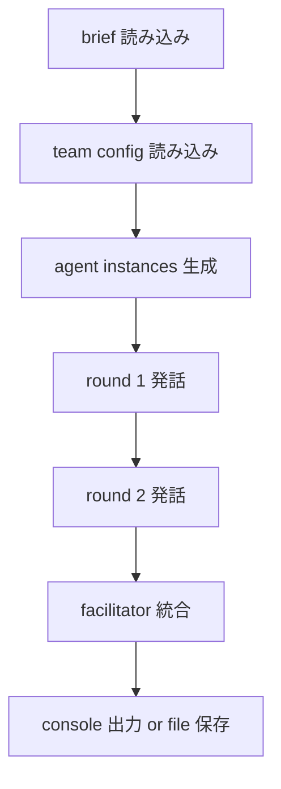

# System Blueprint

## 目的

軽量 multi-agent 協働の最小実装を、mock provider で再現しつつ、将来の model adapter 差し替え先を固定する。

## 初期ディレクトリ構成

```text
iAgents/
├─ docs/
├─ develop/
├─ data/
│  └─ seed/
│     ├─ config/
│     └─ session/
├─ src/
│  └─ iagents/
│     ├─ cli.py
│     ├─ agent.py
│     ├─ models.py
│     └─ orchestrator.py
└─ tests/
```

## 役割

| role | responsibility |
|---|---|
| strategist | 課題の狙い、価値、進め方を整理する |
| critic | リスク、曖昧さ、抜け漏れを指摘する |
| builder | 次に試す具体策を提案する |
| facilitator | 各 agent の出力を統合して最終提案にまとめる |

## 実行 flow



## モジュール境界

- `models.py`
  dataclass と session record
- `agent.py`
  agent role と provider 呼び出しの薄い境界
- `orchestrator.py`
  round 制御、shared context、final synthesis
- `cli.py`
  引数処理、file 入出力、実行トリガ

## provider 方針

- 初期版は dependency-free の mock 生成だけを使う
- 将来の provider は `Agent.generate()` 内で差し替え可能な境界として扱う
- 本接続時も orchestrator の round contract は変えない

## seed data

- `agent_team.sample.json`
  役割、表示名、tone、focus を持つ team 定義
- `brief.md`
  初回実行確認に使う課題メモ
