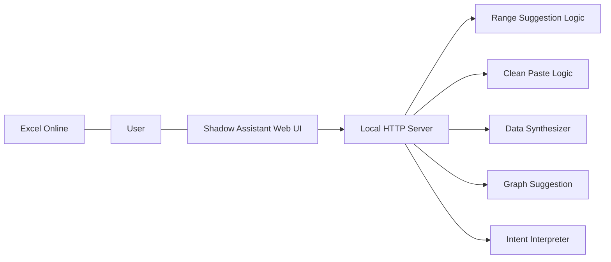

# System Blueprint

## 目的

Excel Online の横で動く external companion app として、Shadow Assistant prototype の feature matrix、API、browser UI を定義する。

## Prototype Feature Matrix

| 機能名称 | prototype の振る舞い | 達成する UX | 備考 |
|---|---|---|---|
| Shadow Bar | 左端の常駐 UI を local web app 上で表現する | そこにいる安心感 | Excel Online の外側で動作 |
| Range Pilot | 名前ボックスの range を入力すると拡張候補を返す | 視点のワープ | 手入力前提の prototype |
| 選択履歴タイムマシン | 直近 5 件の range を localStorage へ保持する | やり直せる自由 | ブラウザ再読込でも保持 |
| Smart Snap | header 行を含む table guess と data body を返す | 意図の補完 | visible rows / cols から推定 |
| Graph Shadow Editor | 表データから棒グラフや複数系列候補を返す | 直感的な造形 | 実グラフ編集の前段 |
| Clean Paste | Markdown table / CSV / TSV / 複数行テキストを正規化する | データの浄化 | single cell formula も返す |
| Data Synthesizer | 2 つの表を見出し union で統合する | 過去遺産の整理 | 新ブック貼り戻し前提 |
| Input Mode Halo | companion app 内で mode halo を可視化する | 状態の透明化 | 概念実証 |
| Semantic Shadow Assist | 自然言語を range / clean paste / chart 候補へ解釈する | 意図の先読み | heuristic ベース |

## Architecture



## 実装構成

```text
iAgents/
├─ data/seed/scenario/
├─ src/iagents/
│  ├─ cli.py
│  ├─ logic.py
│  ├─ server.py
│  └─ web/
│     ├─ index.html
│     ├─ styles.css
│     └─ app.js
└─ tests/
   └─ test_logic.py
```

## API

| endpoint | purpose |
|---|---|
| `GET /api/health` | 起動確認 |
| `POST /api/range/suggest` | Range Pilot / Smart Snap 候補 |
| `POST /api/paste/clean` | Clean Paste |
| `POST /api/data/synthesize` | Data Synthesizer |
| `POST /api/graph/suggest` | Graph Shadow Editor 候補 |
| `POST /api/intent/interpret` | Semantic Shadow Assist |

## Safety ルール

- API は候補だけを返す
- 原本 workbook を直接編集しない
- 統合結果は preview 用の rows と headers に留める
- single cell formula は利用者が確認して Excel Online へ貼り戻す

## 実装対象の段階化

| phase | target |
|---|---|
| prototype phase | `MRL-5` から `MRL-9` の side-by-side companion 実装 |
| implementation phase | `MRL-10` から `MRL-18` の UX 機能ごとの本実装と実確認 |

## Implementation Evidence

- `MRL-10`
  launcher 起動成功、Excel Online 検知、自動 companion open
- `MRL-11`
  Range Pilot 操作手順、所要時間比較、名前ボックス連携結果
- `MRL-12`
  履歴復元成功、Smart Snap 採用結果、範囲漏れ補正例
- `MRL-13`
  グラフ候補提示結果、設定導線の確認ログ
- `MRL-14`
  Clean Paste の before / after 例
- `MRL-15`
  Data Synthesizer の統合 preview 例
- `MRL-16`
  mode halo の状態差確認
- `MRL-17`
  自然言語指示と候補の対応例
- `MRL-18`
  end-to-end UX check と completion evidence
