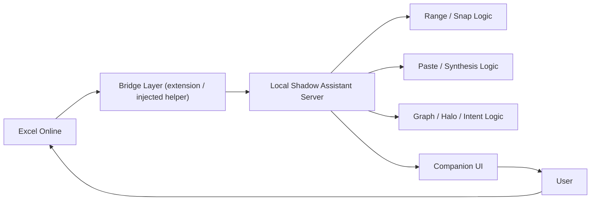

# System Blueprint

## 位置づけ

この文書は、Excel UX 改善の最終形と、そこへ至る実装ルートを整理する source-of-truth である。  
external companion app は中間層として扱い、最終目標は Excel Online 実状態と接続された本実装とする。

## Final Feature Matrix

| 機能名称 | 最終的な振る舞い | 目標 UX | 現在の位置づけ |
|---|---|---|---|
| Shadow Bar | Excel Online 利用中に自然に呼び出せる支援導線 | 常駐する安心感 | companion 版あり、本実装未完 |
| Range Pilot v2 | 実選択範囲を読んで遠方選択候補を返す | 視点ワープ | candidate logic 実装済み |
| Selection Time Machine | 実選択履歴から復元候補を出す | やり直せる自由 | history UI 実装済み |
| Smart Snap | 実表の境界を推定して ghost 候補を返す | 意図の補完 | preview 実装済み |
| Graph Shadow Editor | 実表をもとにグラフ候補と設定補助を返す | 直感的な造形 | suggestion 実装済み |
| Clean Paste | 実貼り付け前データを正規化して渡す | データの浄化 | normalization 実装済み |
| Data Synthesizer | 複数表を統合して新しい分析用表へ寄せる | 過去遺産の整理 | preview 実装済み |
| Input Mode Halo | 実入力状態を可視化する | 状態の透明化 | manual halo 実装済み |
| Semantic Shadow Assist | 実文脈を前提に意図解釈し安全に提案する | 自然な支援 | heuristic 提案実装済み |

## 実装フェーズ

### Phase A: companion foundation

- local server
- web UI
- launcher
- UX 候補ロジック

### Phase B: workbook bridge

- Excel Online と companion の間で状態を受け渡す bridge
- 選択範囲、文脈、入力状態の取得
- local server への安全な state relay

### Phase C: direct assist

- 実状態を前提に Range Pilot / Smart Snap / Halo / Intent を返す
- Clean Paste / Data Synthesizer / Graph 補助を workbook 文脈へ接続

### Phase D: full implementation close

- end-to-end UX check
- 最終 evidence
- 残課題の切り離し

## Target Architecture

## 現在の実装済み部分

- local server
- companion web UI
- launcher
- Range Pilot candidate logic
- Selection Time Machine
- Smart Snap preview
- Clean Paste normalization
- Data Synthesizer preview
- Graph suggestion
- Halo state model
- Semantic intent interpretation

## 未完了差分

- Excel Online の実状態取得
- bridge layer
- 実 workbook 文脈での支援
- 直接操作または安全な handoff 導線
- final UX close
