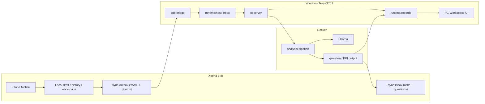
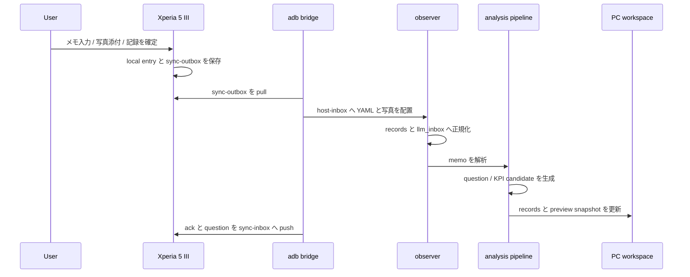
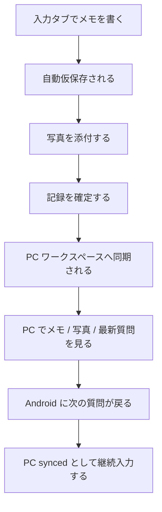

# システム設計図

## 現行方針

`Xperia 5 III + Windows Tezy-GT37` の組み合わせで、まず end-user が使える同期体験を成立させる。

- 将来の正式経路:
  `mDNS discovery -> MAC whitelist -> Syncthing in Docker -> local LLM`
- 現在の実働経路:
  `iClone Mobile -> app local files -> adb bridge -> runtime/host-inbox -> observer -> runtime/records -> runtime/edge-outbox -> Android sync-inbox`

## アーキテクチャ図



## Android-PC 接続シーケンス



## UX フロー



## ディレクトリ構造

```text
iClone/
  android/
    app/src/main/assets/mobile_quick_capture.html
    app/src/main/java/com/iclone/mobile/MainActivity.kt
  preview/
    index.html
    app.js
    styles.css
    mobile_quick_capture.html
  src/host/
    adb_bridge.py
    observer.py
    analysis_pipeline.py
    build_status_snapshot.py
    build_review_snapshot.py
    run_host_app.py
  runtime/
    host-inbox/
    records/
    edge-outbox/
    device-cache/
    logs/
```

## YAML スキーマ

### memo

```yaml
schemaVersion: "1.0.0"
entryId: "entry-20260318-211500"
entryType: "memo"
projectId: "project-alpha"
sessionId: "session-20260318-211500"
capturedAt: "2026-03-18T21:15:00+09:00"
deviceId: "xperia5iii-edge-001"
inputMode: "photo"
body: "現場ホワイトボードの写真を共有します"
attachments:
  - attachmentId: "photo-entry-20260318-211500"
    path: "attachments/photo-entry-20260318-211500.jpg"
    mimeType: "image/jpeg"
projectContext:
  customer: "field-user"
  phase: "validation"
  topic: "onsite_context"
sync:
  peerId: "USB-ADB-XPERIA"
  state: "local_saved"
headline: "ホワイトボード確認"
```

### reverse sync question json

```json
{
  "entryId": "question-entry-20260318-211500",
  "headline": "次の質問",
  "body": "現場で最も遅れている工程はどこですか",
  "projectId": "project-alpha",
  "sessionId": "session-20260318-211500"
}
```

## 実装メモ

- `observer.py` は添付写真を records 側へコピーする
- `build_review_snapshot.py` は PC 側 image preview URL を出す
- `run_host_app.py` は `/runtime/...` をそのまま配信する
- `MainActivity.kt` は JS bridge で draft / entry / history / question を扱う
