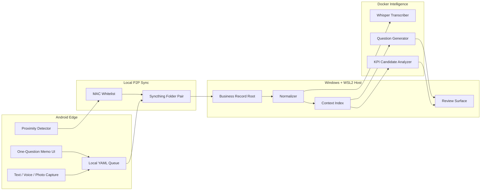
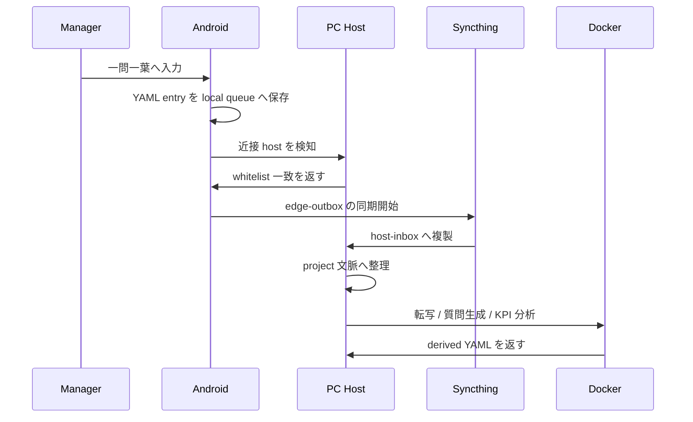
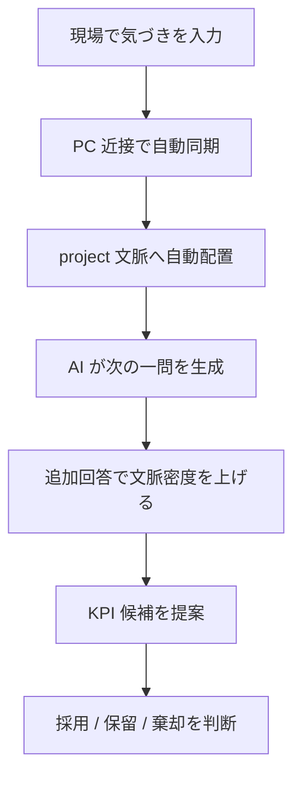

# システム青写真

## 目的

manager context collection system の具体的な構成要素、データ構造、接続方式、推論経路を定義する。

## システムアーキテクチャ図



## Connectivity

### MAC アドレス認証

- PC 側は `known_devices.yaml` を正本にし、許可済み device の MAC、deviceId、peerId を保持する。
- Android 側は host 候補と peerId を保持し、同一 LAN と whitelist 一致を満たしたときだけ同期を有効化する。
- MAC は近接確認の第一段とし、実データ同期は Syncthing peer key とローカル通信保護に委譲する。

### P2P 同期

- edge outbound: `edge-outbox/`
- host inbound: `host-inbox/<deviceId>/`
- host curated store: `records/<projectId>/`
- クラウドは使わず、ローカルネットワーク内双方向同期を前提とする。

## ディレクトリ構造案

```text
iClone/
  docs/
  develop/
  data/
    seed/
      manager_context/
        config/
          known_devices.yaml
        projects/
          project-alpha.yaml
        records/
          project-alpha/
            2026/
              03/
                session-20260317-090000/
                  entries/
                    entry-20260317-090512.yaml
                    question-20260317-091000.yaml
                  attachments/
                    photo-20260317-090533.jpg
                    audio-20260317-090540.m4a
                  derived/
                    transcript-20260317-090540.yaml
                    kpi-candidate-20260317-091500.yaml
  scripts/
```

## YAML スキーマ定義案

### entry YAML

| key | type | required | meaning |
|---|---|---|---|
| `schemaVersion` | string | yes | schema version |
| `entryId` | string | yes | entry 識別子 |
| `entryType` | string | yes | `memo` `question` `transcript` `kpi_candidate` |
| `projectId` | string | yes | project 文脈 |
| `sessionId` | string | yes | 収集 session |
| `capturedAt` | string | yes | ISO 8601 timestamp |
| `deviceId` | string | yes | device 識別子 |
| `inputMode` | string | yes | `text` `voice` `photo` `mixed` |
| `body` | string | yes | 本文 |
| `attachments` | array | no | 添付 path と hash |
| `projectContext` | object | yes | customer、phase、topic など |
| `sync` | object | yes | sync state |
| `ai` | object | no | summary、nextQuestionIds、kpiCandidateIds |

### KPI candidate YAML

| key | type | required | meaning |
|---|---|---|---|
| `candidateId` | string | yes | KPI candidate ID |
| `projectId` | string | yes | 対象 project |
| `generatedAt` | string | yes | 生成時刻 |
| `hypothesis` | string | yes | KPI 仮説 |
| `evidenceEntryIds` | array | yes | 根拠 entry |
| `suggestedMetric` | string | yes | 推奨指標 |
| `nextQuestion` | string | yes | 次に聞くべき一問 |

## 添付ファイル処理

- 写真は EXIF を保持したまま `attachments/` に保存する
- 音声は原本を保持し、文字起こし結果は `derived/` に YAML で保存する
- 添付ファイルは YAML 側に path、mimeType、sha256、capturedAt を記録する

## Android-PC 間の接続シーケンス図



## KPI 発見 UX フロー図



