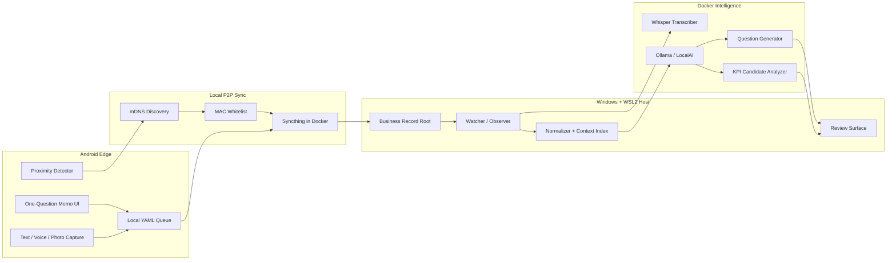
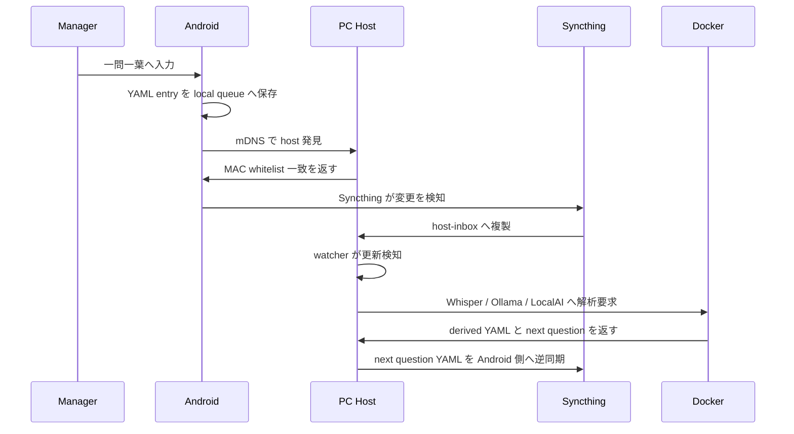
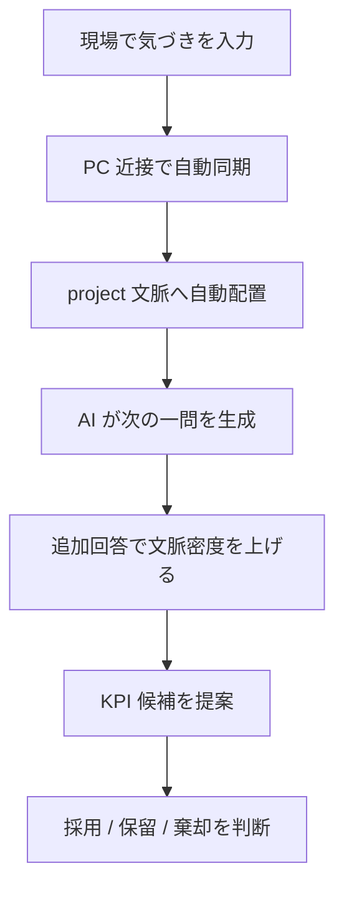

# システム青写真

## 目的

manager context collection system の具体的な構成要素、データ構造、接続方式、推論経路を定義する。

## 構築方針

- まず同期、コンテキストはその後
- host は「ローカル・同期・ハブ」として振る舞う
- Android は自由度の高い一次入力デバイスとして扱う
- LLM は host 側 GPU を活かせる Ollama / LocalAI 系で運用する
- 現行の最適化対象は Xperia 5 III と Windows host `Tezy-GT37` とする
- 将来は複数 OS / 複数スマホへ横展開できるよう、device-specific 部分を config へ閉じ込める

## 現行ターゲットと将来拡張

| scope | current target | future target |
|---|---|---|
| edge | Xperia 5 III | 他 Android / 将来 iOS 系 |
| host | Windows 11 PC `Tezy-GT37` | 他 Windows / Ubuntu host |
| llm runtime | WSL2 Docker | native Ubuntu Docker |

## システムアーキテクチャ図



## 3 層アーキテクチャ

### A. ネットワーク層

- mDNS を使い、Android から `http://pc-name.local` で host を自動発見する
- IP 固定や手入力は初期導線に含めない
- 同一 Wi-Fi 外まで伸ばす場合だけ Tailscale をオプション採用する

### B. 同期エンジン層

- Syncthing を Docker コンテナで動かし、Android の特定フォルダと host ディレクトリを双方向同期する
- Android 側で YAML を保存した瞬間に、PC 側マウントディレクトリへ到達する感覚を狙う

### C. 隔離層

- Windows は WSL2 上の Docker、Ubuntu は native Docker を前提とする
- Syncthing で着弾したディレクトリを、そのまま LLM 読み取り用 mount に接続する

## UI / UX 設計要件

### Android 側 UX

| screen | purpose | key behavior |
|---|---|---|
| `QuickCaptureScreen` | 一問一葉の入力 | 1 問だけ表示し、入力途中でも自動仮保存を継続する |
| `AttachmentTray` | 写真 / 音声追加 | 追加後に入力文脈を切らない |
| `SyncStatusChip` | 同期状態表示 | `saved` `syncing` `synced` `attention` を短文で示す |
| `LocalWorkspaceList` | 端末内メモ一覧 | `新しい順` `古い順` `種別順` で sort できる |
| `ViewHistoryList` | 閲覧履歴再訪 | 最近見たメモへ即座に戻れる |

### PC 側 UX

| screen | purpose | key behavior |
|---|---|---|
| `InboxBoard` | 到着 record の把握 | 同期到着順に並び、処理状態が見える |
| `ContextRecordView` | project 文脈閲覧 | 元ログ、添付、次問、KPI 候補を同時に見る |
| `OpsPanel` | host 状態観測 | Syncthing / Ollama / observer の健全性を確認する |

### UX 検証観点

- Android では入力開始から保存完了まで 5 秒以内を目標とする
- Android では入力途中の断片も自動仮保存で失われないことを必須とする
- PC では同期到着から可視化まで 10 秒以内を目標とする
- 同期エラー時でも、Android と PC のどちらで何が必要か即判別できること

## Connectivity

### MAC アドレス認証

- PC 側は `known_devices.yaml` を正本にし、許可済み device の MAC、deviceId、peerId を保持する。
- Android 側は host 候補と peerId を保持し、同一 LAN と whitelist 一致を満たしたときだけ同期を有効化する。
- MAC は近接確認の第一段とし、実データ同期は Syncthing peer key とローカル通信保護に委譲する。
- host 発見は mDNS、信頼判断は MAC whitelist、同期実体は Syncthing という三段構造で扱う。

### P2P 同期

- edge outbound: `edge-outbox/`
- host inbound: `host-inbox/<deviceId>/`
- host curated store: `records/<projectId>/`
- watcher input: `host-inbox/<deviceId>/`
- llm mount: `runtime/llm_inbox/`
- reverse sync payload: `runtime/edge-outbox/<projectId>/<sessionId>/`
- invalid payload quarantine: `runtime/dead-letter/`
- クラウドは使わず、ローカルネットワーク内双方向同期を前提とする。

## ディレクトリ構造案

```text
iClone/
  docs/
  develop/
  data/
    seed/
      manager_context/
        config/
          host_stack.yaml
          security_policy.yaml
          health_contract.yaml
          extension_boundary.yaml
          known_devices.yaml
        projects/
          project-alpha.yaml
        records/
          project-alpha/
            2026/
              03/
                session-20260317-090000/
                  entries/
                    entry-20260317-090512.yaml
                    question-20260317-091000.yaml
                  attachments/
                    photo-20260317-090533.jpg
                    audio-20260317-090540.m4a
                  derived/
                    transcript-20260317-090540.yaml
                    kpi-candidate-20260317-091500.yaml
  scripts/
```

## 推奨ツール構成

| item | preferred tool | role |
|---|---|---|
| host OS | Windows 11 + WSL2/Docker / Ubuntu 22.04+ | データ蓄積と推論 hub |
| edge OS | Android | 現場の一次収集 |
| discovery | mDNS | host 自動発見 |
| optional remote extension | Tailscale | 同一 Wi-Fi 外の安全な延長 |
| sync engine | Syncthing in Docker | P2P フォルダ同期 |
| llm hub | Ollama / LocalAI | ローカル推論 API |

## 実装骨格

| component | current file target | responsibility |
|---|---|---|
| host compose | `docker-compose.yml` | Syncthing / Ollama / observer を起動 |
| host observer | `src/host/observer.py` | host-inbox を監視し records へ正規化し、analysis と dead-letter を起動 |
| analysis pipeline | `src/host/analysis_pipeline.py` | transcript、next question、KPI candidate、edge reverse sync payload を生成 |
| retry tool | `src/host/retry_dead_letters.py` | dead-letter payload を host-inbox へ再投入する |
| end-to-end validation | `src/host/run_end_to_end_validation.py` | seed entry から analysis / reverse sync / dead-letter を一括検証する |
| host setup | `scripts/start_host_stack.ps1` | runtime directory と compose 起動 |
| runtime layout | `runtime/` | inbox、records、llm inbox、edge outbox、dead-letter、logs |

## YAML スキーマ定義案

### entry YAML

| key | type | required | meaning |
|---|---|---|---|
| `schemaVersion` | string | yes | schema version |
| `entryId` | string | yes | entry 識別子 |
| `entryType` | string | yes | `memo` `question` `transcript` `kpi_candidate` |
| `projectId` | string | yes | project 文脈 |
| `sessionId` | string | yes | 収集 session |
| `capturedAt` | string | yes | ISO 8601 timestamp |
| `deviceId` | string | yes | device 識別子 |
| `inputMode` | string | yes | `text` `voice` `photo` `mixed` |
| `headline` | string | yes | 一覧表示用の短い見出し |
| `body` | string | yes | 本文 |
| `attachments` | array | no | 添付 path と hash |
| `projectContext` | object | yes | customer、phase、topic など |
| `sync` | object | yes | sync state |
| `draft` | object | yes | auto-save 状態、最後の端末保存時刻 |
| `history` | object | no | 端末閲覧履歴、最後の閲覧時刻 |
| `ai` | object | no | summary、nextQuestionIds、kpiCandidateIds |

### auto-save / local browse schema 補足

- `draft.state` は `implicit_saved` `finalized` `archived` を取る
- `draft.savedAt` は保存ボタン未押下でも更新され、端末内の復元起点になる
- `headline` は text なら本文先頭、voice なら transcript 要約、photo なら利用者入力ラベルまたは補助抽出ラベルを使う
- `history.lastViewedAt` は端末側閲覧履歴へ反映し、一覧とは別の最近見た導線を構成する

### KPI candidate YAML

| key | type | required | meaning |
|---|---|---|---|
| `candidateId` | string | yes | KPI candidate ID |
| `projectId` | string | yes | 対象 project |
| `generatedAt` | string | yes | 生成時刻 |
| `hypothesis` | string | yes | KPI 仮説 |
| `evidenceEntryIds` | array | yes | 根拠 entry |
| `suggestedMetric` | string | yes | 推奨指標 |
| `nextQuestion` | string | yes | 次に聞くべき一問 |

## 添付ファイル処理

- 写真は EXIF を保持したまま `attachments/` に保存する
- 音声は原本を保持し、文字起こし結果は `derived/` に YAML で保存する
- 添付ファイルは YAML 側に path、mimeType、sha256、capturedAt を記録する
- 音声メモは transcript の先頭要約から文字見出しを生成する
- 画像メモは利用者入力ラベルを優先し、未入力時は補助抽出ラベルで文字見出しを付ける
- Android で保存したファイルは Syncthing が数秒以内に host mount へ複製する想定とする

## Intelligence orchestration 実装方針

- 初期実装では deterministic rule を使い、memo 本文と topic から next question と KPI candidate を生成する
- 音声添付がある entry では transcript YAML を host 側で追加生成する
- 生成した question YAML は `runtime/edge-outbox/` へ書き戻し、Android 側逆同期の source とする
- 実機 Android 未接続でも host 側 closed loop を seed validation で検証できる構成とする

## Hardening / observability

- 必須 key 欠落 entry は `runtime/dead-letter/` へ隔離する
- `retry_dead_letters.py` で dead-letter payload を再投入できる
- status snapshot は observer / analysis / retry の tail、reverse sync readiness、dead-letter 有無を出す
- device-specific 差分は `extension_boundary.yaml` に閉じ込め、Xperia 5 III 以外への将来拡張を分離する

## Android-PC 間の接続シーケンス図



## KPI 発見 UX フロー図


