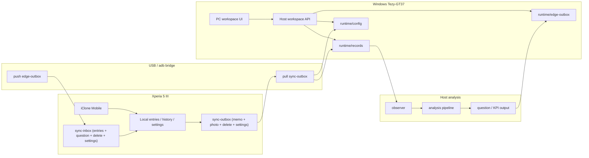

# システム設計書

## 実装対象

`Xperia 5 III + Windows Tezy-GT37` を first target とし、clone-first workspace を構築する。

## clone-first 構成

- mobile:
  local entry save
  sync schedule
  delete / resync
- desktop:
  host workspace entry create
  sync schedule
  delete / resync
- bridge:
  memo
  photo
  delete request
  settings
  question

## アーキテクチャ図

## 主要 UX ルール

### status

- 上部に小さい `Local / PC / PC synced` ラベルだけ置く
- color と check / x で判定できればよい

### counts

- footer に小さく置く
- editor / workspace list より目立たせない

### settings

- `auto save` と `auto sync` を両端末で持つ
- interval は `realtime` `10s` `1m`
- 次回予定を UI に明示する

### delete

- mobile / PC の両端末から実行可能
- delete request は clone payload として相手側にも送る

## 現在の API / bridge payload

### host API

- `GET /api/workspace/bootstrap`
- `POST /api/workspace/entries`
- `POST /api/workspace/settings`
- `POST /api/workspace/sync-now`
- `DELETE /api/workspace/entries/{entryId}`

### bridge payload

- `sync-outbox/*.yaml`
  mobile memo
- `sync-outbox/deletes/*.json`
  mobile delete
- `sync-outbox/settings/*.json`
  mobile settings
- `edge-outbox/entries/*.json`
  host memo clone to mobile
- `edge-outbox/deletes/*.json`
  host delete to mobile
- `edge-outbox/settings/*.json`
  host settings to mobile

## 検証成果物

- 実行手順:
  `docs/process/UX_check_work_flow.md`
- UX 自動検証:
  `docs/process/UX_auto_validation_report.md`
