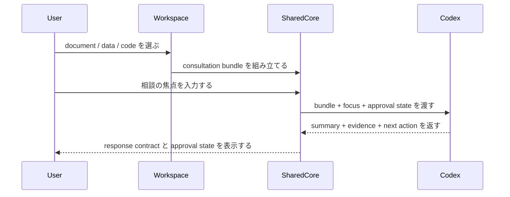

# North Star

## Human Goal

`iDevelop` の中心価値は、ユーザーが文書・データ・コードを材料として選び、このソフトの中から Codex に相談し、根拠付きの返答と次アクションを得られることにある。dashboard は閲覧専用の終点ではなく、ユーザーと Codex の協働を支える consultation workspace として扱う。

## Scope Boundary

- この project の変更対象は `iDevelop/` 配下だけとする
- companion project `iSensorium/` とは境界ルールだけを共有し、実装・計画・履歴は分離する
- `iDevelop` は Codex 相談の入口を担う companion project である

## Non-Negotiables

- MVC を崩さない
- BDD で体験を定義し、TDD で実装を進める
- must scope は `document` と `data`
- `code` は phase gate を維持しつつ、相談材料としての参照価値を評価する
- live connection は safety-first で始め、いきなり自由編集へ進まない
- ユーザーが Codex に渡す対象、Codex が返す根拠、承認状態を明示する
- release line と plan set は、ユーザー指示がない限り連番で継続する
- 一度採用した ID、名称、状態名、artifact 名、source policy 名は、明示変更がない限り継続利用する

## Reuse Direction

- 他 project にコピーして使える project contract を維持する
- project ごとの差分は manifest で吸収する
- document / data / code は recursive read を基本とする
- live connection は read-first / consult-first / safety-first を原則にする
- 汎用性は「閲覧機能の再利用」だけでなく、「相談対象 bundle を Codex に渡せること」まで含めて定義する

## Success Criteria For The Current Phase

- consultation session contract が source-of-truth に定義されている
- 文書とデータを相談材料として選び、質問し、根拠付き応答を受け取る release line 計画が定義されている
- shared conversation shell、approval state、proposal-to-action が plan に落ちている

## Current BDD Story

### Story Summary

- experience:
  利用者は workspace で材料を選び、Codex に相談し、根拠と次 action を受け取る
- touchpoints:
  bundle selection、focus input、response review、approval state confirmation
- value:
  閲覧で終わらず、次の判断に進める consultation workspace を得る
- function elements:
  input bundle、response contract、approval state、phase gate
- technology elements:
  `shared-core` consultation session model、workspace controller、read-only repository、history/evidence

### Sequence

### Behavior Leaves

- `document-bundle-fixed`
- `document-response-schema-fixed`
- `document-approval-state-visible`
- `data-bundle-fixed`
- `data-response-schema-fixed`
- `data-approval-state-visible`
- `code-bundle-fixed`
- `code-response-schema-fixed`
- `code-phase-gate-visible`

### Acceptance Criteria

| behavior_id | acceptance |
|---|---|
| `document-bundle-fixed` | 文書 workspace は選択中文書を consultation bundle として一意に表現できる |
| `document-response-schema-fixed` | document consultation は `summary` `evidence` `next_action` の response contract を持つ |
| `document-approval-state-visible` | document consultation は apply ではなく `consultation-only` state を表示する |
| `data-bundle-fixed` | data workspace は少なくとも 1 dataset を consultation bundle として表現できる |
| `data-response-schema-fixed` | data consultation は document と同じ response contract を共有する |
| `data-approval-state-visible` | data consultation は apply ではなく `consultation-only` state を表示する |
| `code-bundle-fixed` | code workspace は read-only target を consultation bundle として表現できる |
| `code-response-schema-fixed` | code consultation も `summary` `evidence` `next_action` contract を共有する |
| `code-phase-gate-visible` | code consultation は `phase-gated-read-only` state を表示し、実行や attach を許可しない |
