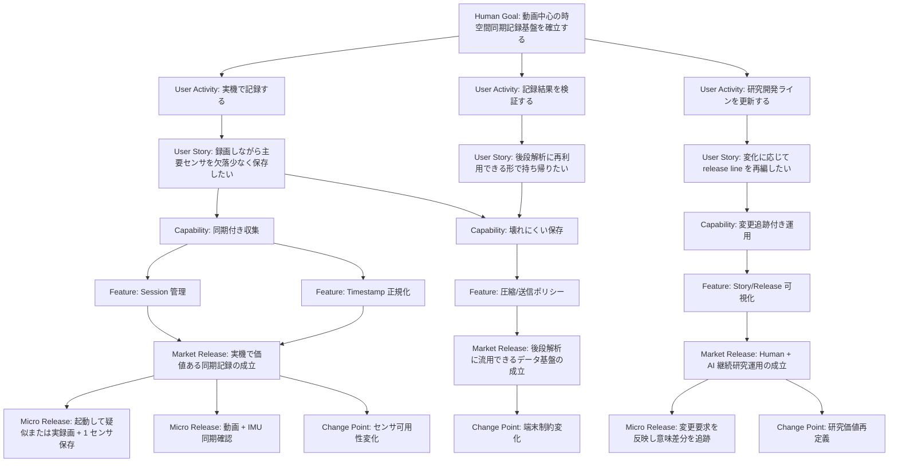

# ストーリーとリリース対応表

## 階層

このプロジェクトの価値構造は、常に以下の順で定義する。

1. 人の目標
2. 利用者アクティビティ
3. ユーザーストーリー
4. システム能力
5. 実装可能機能
6. 市場リリースライン
7. マイクリリースライン
8. 変更 / 拡張ポイント

## 意味ルール

- 人の目標 は不変条件に近い最上位目的。
- 利用者アクティビティ は利用者が行いたい行動。
- ユーザーストーリー は行動が価値に変換される単位。
- システム能力 はシステムが持つべき能力。
- 実装可能機能 は実装可能な機能単位。
- 市場リリースライン は外部価値が成立した意味単位。
- マイクリリースライン は実機で体験可能な検証到達点。
- 変更 / 拡張ポイント は後で差し替えや拡張が起こりうる接続点。

## Market と Micro の分離

| レイヤ | 定義 | 必須内容 |
|---|---|---|
| 市場リリースライン | 社会、現場、研究、運用に対して説明可能な価値成立ライン | 成立価値、対象者、成立条件、見直し要因 |
| マイクリリースライン | 実機スマホで体験し、次学習へ接続できる小到達点 | 体験内容、観測項目、成功条件、失敗時次アクション |

## 最低限必要な項目

### Market Release Line の項目

- ID
- name
- parent goal / activity / story
- delivered value
- entrance criteria
- exit criteria
- linked micro releases
- change drivers

### Micro Release Line の項目

- ID
- parent market release
- developer experience
- verification method
- expected result
- failure split
- next decomposition target
- status

## Mermaid ルール

- 価値階層と release 階層は同一 Mermaid 内で表現してよい。
- ただし `Market Release` と `Micro Release` の node label を必ず分ける。
- 現在地、変更候補、保留、廃止候補は注釈で示す。
- Mermaid の正式版はこのファイルだけに置く。

## 初期骨格

## 2026-03-15 追補: Guarded Upstream Trial

- 新しい変更ポイント: `frozen CameraX path -> shared-camera-session-adapter seam`
- `MRL-6 guarded upstream trial` は、guarded な切替 seam と rollback 条件を固定する準備 line として完了した
- `MRL-7 guarded replacement runtime wiring` は、既存 session in/out contract を維持したまま、replacement runtime を seam の裏へ実接続する line とする
- `MRL-8 guarded upstream stabilization` は、replacement runtime 接続後の session lifecycle、preview continuity、refresh、rollback 導線を guarded のまま安定化する line とする
- `MRL-9 user UX check ready` は、利用者準備と UX 観察点を replacement route 前提で固定し、実 UX 確認へ渡す line とする
- `MRL-7` は完了済みであり、guarded route は `shared-camera-session-adapter` の裏で actual replacement runtime を起動できる
- `MRL-8` は完了済みであり、replacement route の stop / failure / shutdown / refresh は frozen preview 復帰込みで安定化済みである
- `MRL-9` は完了済みであり、利用者は app 内 switch で guarded replacement route を選んで UX check を開始できる
- `MRL-10 guarded replacement preview MVP` は完了済みであり、shared camera capture session の target を増やさず、recorder に流れる保存用フレームの複製から `640x480` 系 `5fps` 始動の live preview を作る line とした
- `MRL-7` 以降のマイクリリース焦点:
  - `mRL-7-1`: `shared-camera-session-adapter` の裏へ actual replacement runtime を実装する
  - `mRL-7-2`: frozen artifact contract を維持したまま required artifact 群を replacement runtime で出力する
  - `mRL-7-3`: requested route が guarded condition 下で active replacement route へ切り替わることを検証する
  - `mRL-8-1`: replacement route の session lifecycle と fallback 復帰を安定化する
  - `mRL-8-2`: preview / stop / refresh の UX 退行が guarded 条件内で抑制されることを確認する
  - `mRL-8-3`: rollback drill と parser / contract check を replacement route でも閉じる
  - `mRL-9-1`: `UX_check_work_flow.md` を replacement route 観察点込みへ更新する
  - `mRL-9-2`: current state / release map / history を user UX check ready 状態へ更新する
  - `mRL-9-3`: 実 UX 確認の入口を固定し、採用 / guarded 継続 / rollback の分岐条件を明示する
  - `mRL-10-1`: recorder 経路に preview tap を追加し、保存経路を変えずに latest-only preview bus を作る
  - `mRL-10-2`: replacement route recording 中だけ `640x480` 系 `5fps` MVP preview を UI に表示する
  - `mRL-10-3`: Xperia 5 III 実機で recording 成立、保存整合維持、preview 更新を検証し docs / history を閉じる
  - `MRL-10` 完了状態: short-interval toggle crash なし、`Start Session -> Stop Session -> Refresh` 維持、preview 向き補正込みで live 表示
