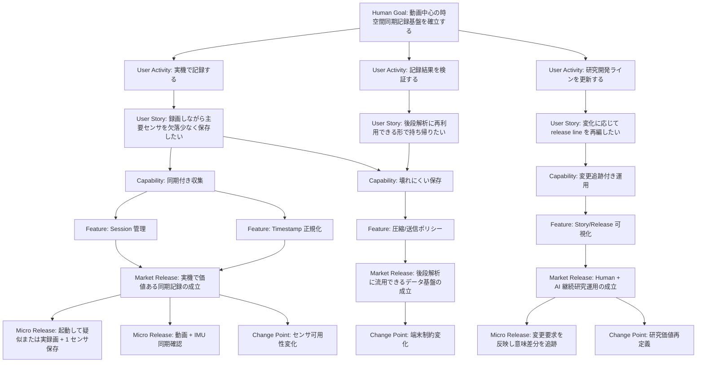

# Story And Release Map

## Hierarchy

このプロジェクトの価値構造は、常に以下の順で定義する。

1. Human Goal
2. User Activities
3. User Stories
4. System Capabilities
5. Implementable Features
6. Market Release Lines
7. Micro Release Lines
8. Change / Expansion Points

## Meaning Rules

- Human Goal は不変条件に近い最上位目的。
- User Activities は利用者が行いたい行動。
- User Stories は行動が価値に変換される単位。
- System Capabilities はシステムが持つべき能力。
- Implementable Features は実装可能な機能単位。
- Market Release Line は外部価値が成立した意味単位。
- Micro Release Line は実機で体験可能な検証到達点。
- Change / Expansion Points は後で差し替えや拡張が起こりうる接続点。

## Market And Micro Separation

| Layer | Definition | Must Include |
|---|---|---|
| Market Release Line | 社会、現場、研究、運用に対して説明可能な価値成立ライン | 成立価値、対象者、成立条件、見直し要因 |
| Micro Release Line | 実機スマホで体験し、次学習へ接続できる小到達点 | 体験内容、観測項目、成功条件、失敗時次アクション |

## Minimal Required Fields

### Market Release Line

- ID
- name
- parent goal / activity / story
- delivered value
- entrance criteria
- exit criteria
- linked micro releases
- change drivers

### Micro Release Line

- ID
- parent market release
- developer experience
- verification method
- expected result
- failure split
- next decomposition target
- status

## Mermaid Rules

- 価値階層と release 階層は同一 Mermaid 内で表現してよい。
- ただし `Market Release` と `Micro Release` の node label を必ず分ける。
- 現在地、変更候補、保留、廃止候補は注釈で示す。
- Mermaid の正式版はこのファイルだけに置く。

## Initial Skeleton

## 2026-03-15 Addendum: Guarded Upstream Trial

- New change point: `frozen CameraX path -> shared-camera-session-adapter seam`.
- New market target after documentation discipline: `MRL-6 guarded upstream trial`.
- New micro release focus:
  - `mRL-6-1`: route preserved outer session operations through the adapter seam.
  - `mRL-6-2`: keep frozen artifact contract while adding guarded trial metadata.
  - `mRL-6-3`: declare reversible cutover gate and verification conditions before real replacement runtime wiring.
