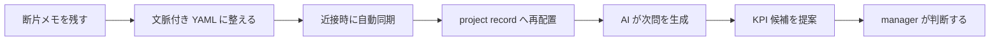

# ストーリーとリリース対応表

## 目的

この文書は manager context collection system の価値連鎖、ユーザーストーリー、Market Release Line の対応を俯瞰する正本とする。
累積 release 台帳の主参照は develop 側の次の 2 ファイルとする。

- [market_release_lines.md](/Users/tetsuya/playground/Data_Correcting_System/iSensorium/develop/plans/2026-03-17-016/market_release_lines.md)
- [micro_release_lines.md](/Users/tetsuya/playground/Data_Correcting_System/iSensorium/develop/plans/2026-03-17-016/micro_release_lines.md)

## 現在の構想線

- `MRL-0` から `MRL-13`:
  旧 capture research line。履歴として保持する。
- `MRL-14` 以降:
  manager context collection system への pivot line。

## 人の目的

忙しい manager が、その場で残した断片メモを project 文脈付き record に変換し、AI の問いを通じて「追うべき KPI 候補」を見つけられるようにする。

## ストーリー層

1. 数秒でメモを残せる
2. 写真、音声、テキストを同じ文脈に束ねられる
3. 近接時に PC へ自動同期される
4. 同期後に project 文脈へ自動配置される
5. AI が一問一葉で次の問いを返せる
6. KPI 候補と根拠ログを対応付けて提示できる
7. 近接認証とローカル推論で機密を守れる
8. manager が採用 / 保留 / 棄却を運用できる

## MRL 対応

| story cluster | 対応 MRL | delivered value |
|---|---|---|
| quick memo baseline | `MRL-14` | YAML 正本、project context、seed data、基本 UX 契約 |
| proximity auth and P2P sync | `MRL-15` | MAC whitelist、Syncthing contract、attachment 整理 |
| multimodal capture and one-question UX | `MRL-16` | text / voice / photo intake と一問一葉 UI |
| local intelligence and KPI discovery | `MRL-17` | Whisper、質問生成、KPI candidate 提案 |
| review surface and operational hardening | `MRL-18` | review 導線、retry、security、evidence |

## 価値連鎖

## 現在の到達点

- `MRL-14` を active line とし、構想、schema、seed data、release planning を着手済みとする。
- 実コードはまだ manager context collection system へ移っていないため、現時点の completion evidence は文書・計画・seed data に限る。

## レビュー方針

- project truth は `north_star.md` と `system_blueprint.md` を主に見る。
- 現在の実行対象は `current_state.md` と develop 側の active plan set を突き合わせる。
- 旧 capture line の履歴は必要時のみ参照し、active scope と混同しない。
