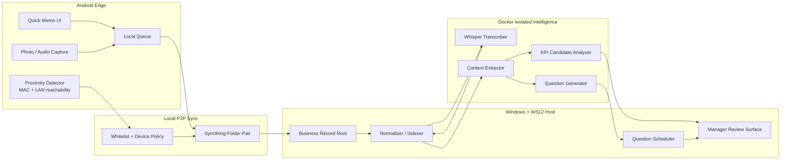
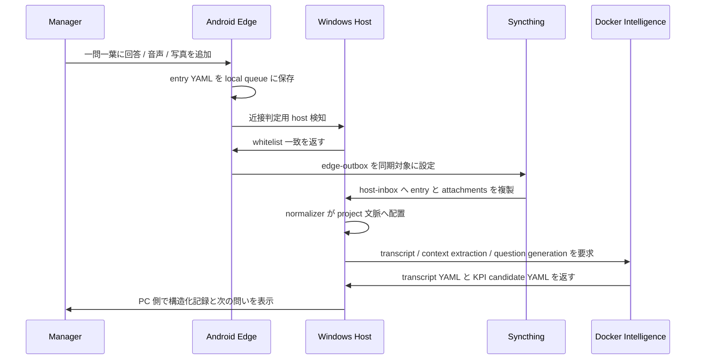
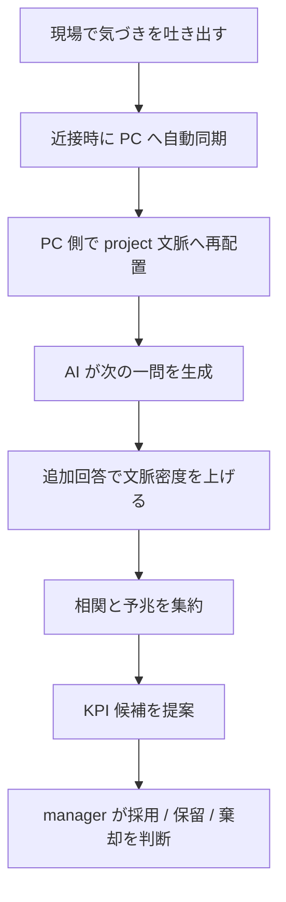

# 文書化向けシステム青写真

## 目的

この文書は manager context collection system の実装仕様骨格を定義する。
接続、同期、YAML 契約、質問生成、KPI 発見に至るまでの主要構成を、実装前に共通理解として固定する。

## アーキテクチャ要約

- edge:
  Android で一問一葉入力、音声、写真、近接検知、同期トリガを扱う。
- host:
  Windows 上の business record root と Syncthing peer、WSL2 Ubuntu 上の整形サービスと Docker 実行を扱う。
- intelligence:
  Docker 内で転写、質問生成、文脈抽出、KPI 候補提案を行う。
- canonical storage:
  project ごとの YAML log と attachment manifest を正本とする。

## システムアーキテクチャ図



## 実装責務

### A. 同期・認証プロトコル

- PC 側は `known_devices.yaml` を正本とし、許可済み Android device の MAC、deviceId、peerId、displayName を保持する。
- Android 側は host 候補の `peerId` と `lastSeenHost` を保持し、同一 LAN + whitelist 一致時だけ同期有効化へ進む。
- MAC は近接シグナルであり、暗号化通信そのものは Syncthing peer key と local TLS で担保する。
- P2P 同期対象は次の 2 root に限定する。
  - edge outbound: `edge-outbox/`
  - host inbound mirror: `host-inbox/<deviceId>/`
- Wi-Fi 不可時は Android ローカル queue へ溜め、Bluetooth 近接は「同期試行を開始してよい」補助判定として使う。

### B. データ構造とストレージ

- 正本 unit は `entry YAML + attachments directory + derived directory` の組で管理する。
- 1 entry は必ず `entryId`、`projectId`、`capturedAt`、`deviceId`、`inputMode`、`body` を持つ。
- 添付実体は binary のまま保持し、YAML 側には path、MIME、hash、capture metadata だけを書く。
- 後段生成物は元 entry を上書きせず、`derived/` 下に転写、質問、KPI 候補を追記する。

## ディレクトリ構造案

```text
iSensorium/
  data/
    seed/
      manager_context/
        config/
          known_devices.yaml
        projects/
          project-alpha.yaml
        records/
          project-alpha/
            2026/
              03/
                session-20260317-090000/
                  entries/
                    entry-20260317-090512.yaml
                    question-20260317-091000.yaml
                  attachments/
                    photo-20260317-090533.jpg
                    audio-20260317-090540.m4a
                  derived/
                    transcript-20260317-090540.yaml
                    kpi-candidate-20260317-091500.yaml
  docs/
  develop/
```

## YAML スキーマ定義案

### entry YAML

| key | type | required | meaning |
|---|---|---|---|
| `schemaVersion` | string | yes | 互換性管理 |
| `entryId` | string | yes | 一意な entry ID |
| `entryType` | string | yes | `memo` `question` `transcript` `kpi_candidate` など |
| `projectId` | string | yes | 文脈を紐付ける project |
| `sessionId` | string | yes | 近接同期単位または収集セッション |
| `capturedAt` | string | yes | ISO 8601 |
| `deviceId` | string | yes | Android device 識別子 |
| `hostId` | string | no | 同期先 host 識別子 |
| `inputMode` | string | yes | `text` `voice` `photo` `mixed` |
| `body` | string | yes | 利用者の主文 |
| `tags` | array string | no | 任意タグ |
| `projectContext` | object | yes | topic、customer、phase、meeting など |
| `attachments` | array object | no | path、mimeType、sha256、capturedAt |
| `sync` | object | yes | peer、state、lastSyncedAt |
| `ai` | object | no | summary、signals、nextQuestionIds、kpiCandidateIds |

### derived transcript YAML

| key | type | required | meaning |
|---|---|---|---|
| `entryId` | string | yes | 元 entry 参照 |
| `derivedType` | string | yes | `transcript` |
| `engine` | string | yes | Whisper 実装名 |
| `language` | string | yes | `ja` など |
| `segments` | array object | yes | startSec、endSec、text |
| `confidence` | number | no | 推定信頼度 |

### KPI candidate YAML

| key | type | required | meaning |
|---|---|---|---|
| `candidateId` | string | yes | KPI 候補 ID |
| `projectId` | string | yes | 対象 project |
| `generatedAt` | string | yes | 生成時刻 |
| `theme` | string | yes | 気づきテーマ |
| `hypothesis` | string | yes | KPI 仮説本文 |
| `evidenceEntryIds` | array string | yes | 根拠 entry |
| `suggestedMetric` | string | yes | 観測すべき指標 |
| `leadingSignals` | array string | yes | 予兆 |
| `nextQuestion` | string | yes | 一問一葉の次問 |
| `confidenceLabel` | string | yes | `low` `medium` `high` |

## 添付フォルダ設計

- 写真:
  `attachments/photo-YYYYMMDD-HHMMSS.jpg`
- 音声:
  `attachments/audio-YYYYMMDD-HHMMSS.m4a`
- 元 binary と派生 YAML は同名接頭辞で追跡可能にする。
- 高解像度写真の EXIF は保持し、YAML へ抜粋メタデータだけ複写する。
- 音声は transcoding 前の原本を残し、文字起こしは `derived/` へ出す。

## Android-PC 接続シーケンス図



## Interaction Engine

- 質問生成入力:
  過去 7 日の entry、未解消 KPI 候補、project phase、未回答テーマ。
- 質問生成出力:
  1 回に 1 問だけ提示し、回答所要時間は 30 秒以内を目標とする。
- 優先順位:
  1. KPI 候補の根拠を補強する問い
  2. project 文脈が欠落している entry を補う問い
  3. 同一テーマの偏りを減らす問い
- マルチモーダル入力は最終的に同一 `entry YAML` へ集約し、`inputMode` と `attachments` で差分表現する。

## Intelligence Orchestration

- Docker container 群:
  - `transcriber`
  - `context-analyzer`
  - `question-generator`
  - `kpi-suggester`
- host 側 orchestrator は raw data mount を read-only で渡し、派生 YAML の書込先だけを限定 mount する。
- KPI 抽出 prompt は次を入力とする。
  - 直近の entry 群
  - topic frequency
  - unresolved question 群
  - 過去の KPI candidate と confidence

## KPI 発見 UX フロー図



## 開発フェーズ

| phase | focus | main output |
|---|---|---|
| Phase 1 | YAML 正本と近接同期基盤 | schema、seed data、Syncthing contract |
| Phase 2 | Android quick memo UX | 一問一葉 UI、音声 / 写真入力 |
| Phase 3 | host normalizer と project context | record root、project mapping、derived pipeline |
| Phase 4 | local LLM orchestration | transcript、質問生成、KPI 候補 |
| Phase 5 | 運用 hardening | retry、security、evidence、rollback |

## 参照 seed data

- `data/seed/manager_context/config/known_devices.yaml`
- `data/seed/manager_context/projects/project-alpha.yaml`
- `data/seed/manager_context/records/project-alpha/2026/03/session-20260317-090000/entries/*.yaml`

## 実装スレッドで固定して扱う論点

1. edge / host / intelligence の責務境界
2. MAC whitelist と peer key の役割分離
3. YAML schema versioning
4. 添付ファイルの hash と manifest 契約
5. question generation の入力窓
6. KPI candidate の根拠追跡
7. Docker 隔離と mount policy
